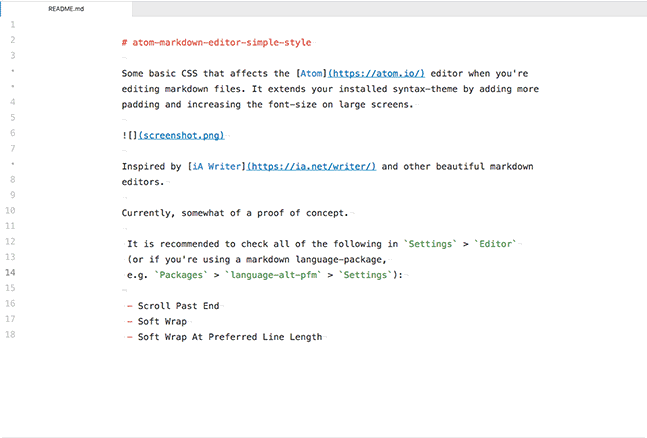

# atom-markdown-editor-simple-style

Some basic CSS that affects the [Atom](https://atom.io/) editor when you're editing markdown files. It extends your installed syntax-theme by adding more padding and increasing the font-size on large screens.

Inspired by [iA Writer](https://ia.net/writer/) and other beautiful markdown editors.

Currently, somewhat of a proof of concept.

 It is recommended to check all of the following in `Settings` > `Editor`
 (or if you're using a markdown language-package,
 e.g. `Packages` > `language-alt-pfm` > `Settings`):

 - Scroll Past End
 - Soft Wrap
 - Soft Wrap At Preferred Line Length
